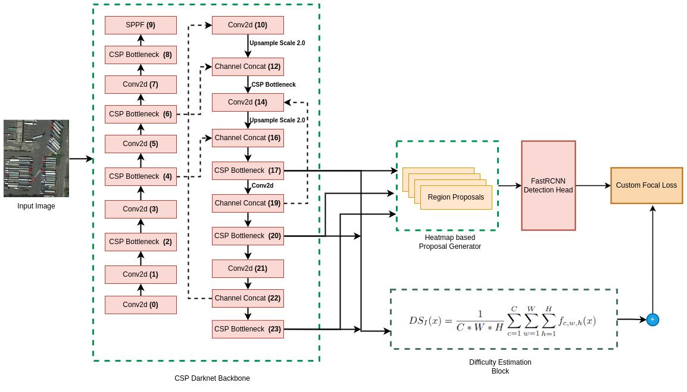

# SOD
Small Object Detection feature extractor

This repository is the implementation of the following papers:

1. [Small Object Difficulty (SOD) Modeling for Objects Detection in Satellite Images](https://ieeexplore.ieee.org/abstract/document/10008383)

## Installation

1. Create and activate a new conda environment (Recommended to use Python>=3.9)
2. Install PyTorch & cuda from [official website](https://pytorch.org/get-started/locally/)<br />
**Note:** It is recommended to install CUDA version >= 11.0
3. Clone the repository in local
```bash
$ cd SOD
$ python -m pip install -e CenterNet2
$ cd CenterNet2
$ pip install -r requirements.txt
```

## Architecture




## Instruction for feature extraction

This repository can be used to extract and save features from any image dataset. We have ready training and validation files for DOTA, DIOR, Visdrone and Xview datasets. The files are under CenterNet2/projects/CenterNet2/. The feature extraction can be done in training and inference mode both. To run this repository the annotation for datasets should be prepared following the COCOJson format style. Please follow the following instructions for feature extraction.

## Extraction in training process

train_net_*.py allows you to train new model from strach.
```bash
$ cd /home/username/SOD/CenterNet2/projects/CenterNet2/
$ python train_net_*.py select any for 
$ python train_net_multi_datasets_UAV.py for Vsidrone to UAVDT dataset UDA training 
```

## Extraction in Validation process

validation.py allows you to run inference on trained a model. User need to provide the annotations(COCO json format) and images
```bash
$ cd /home/username/SOD/CenterNet2/projects/CenterNet2
$ python validation.py for all dataset inference
```

## Citation

If you find this project useful for your research, please use the following BibTeX entry.

    @inproceedings{biswas2022small,
    title={Small Object Difficulty (SOD) Modeling for Objects Detection in Satellite Images},
    author={Biswas, Debojyoti and Te{\v{s}}i{\'c}, Jelena},
    booktitle={2022 14th International Conference on Computational Intelligence and Communication Networks (CICN)},
    pages={125--130},
    year={2022},
    organization={IEEE}
    }
    
    @inproceedings{zhou2021probablistic,
      title={Probabilistic two-stage detection},
      author={Zhou, Xingyi and Koltun, Vladlen and Kr{\"a}henb{\"u}hl, Philipp},
      booktitle={arXiv preprint arXiv:2103.07461},
      year={2021}
    }